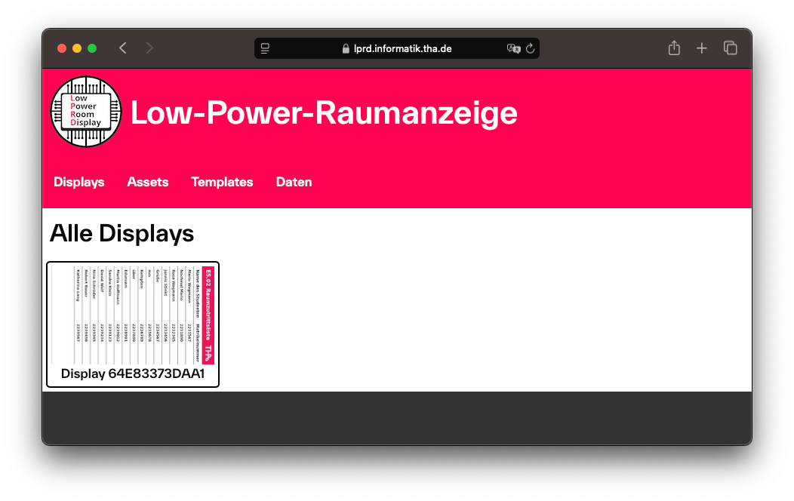
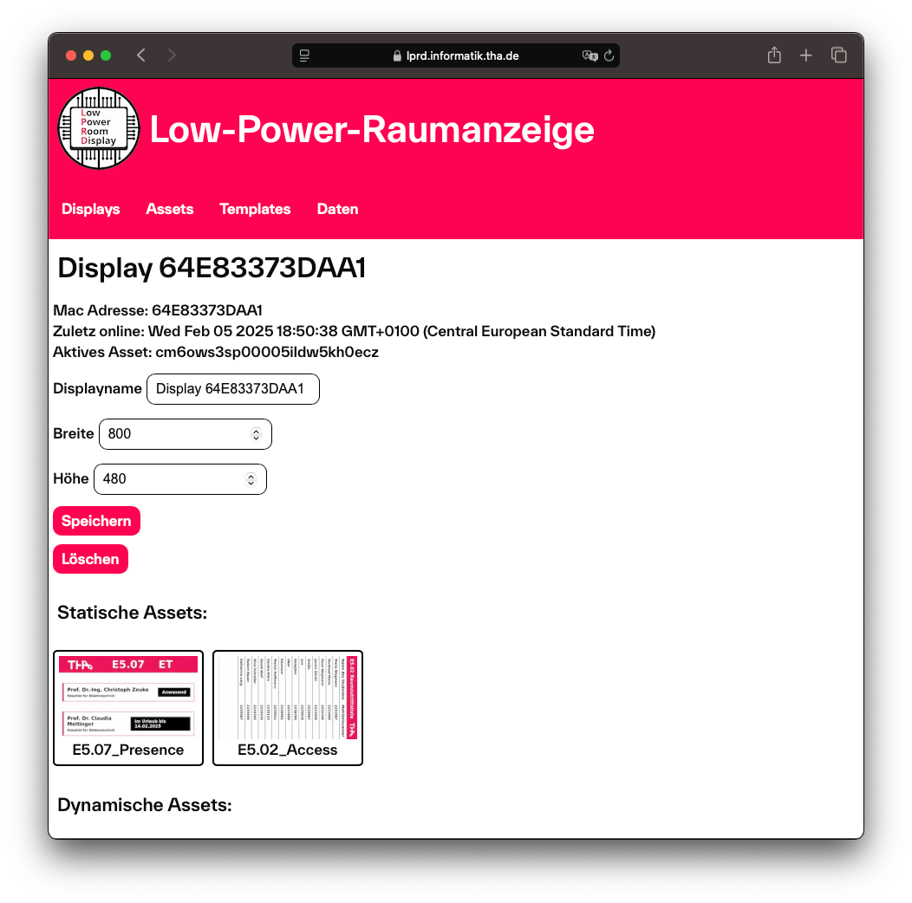
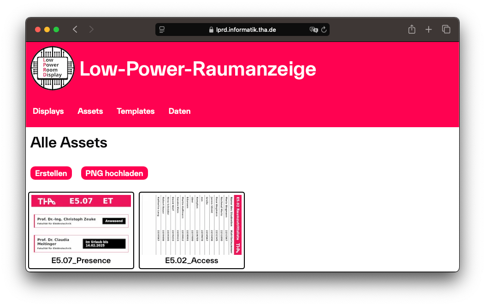
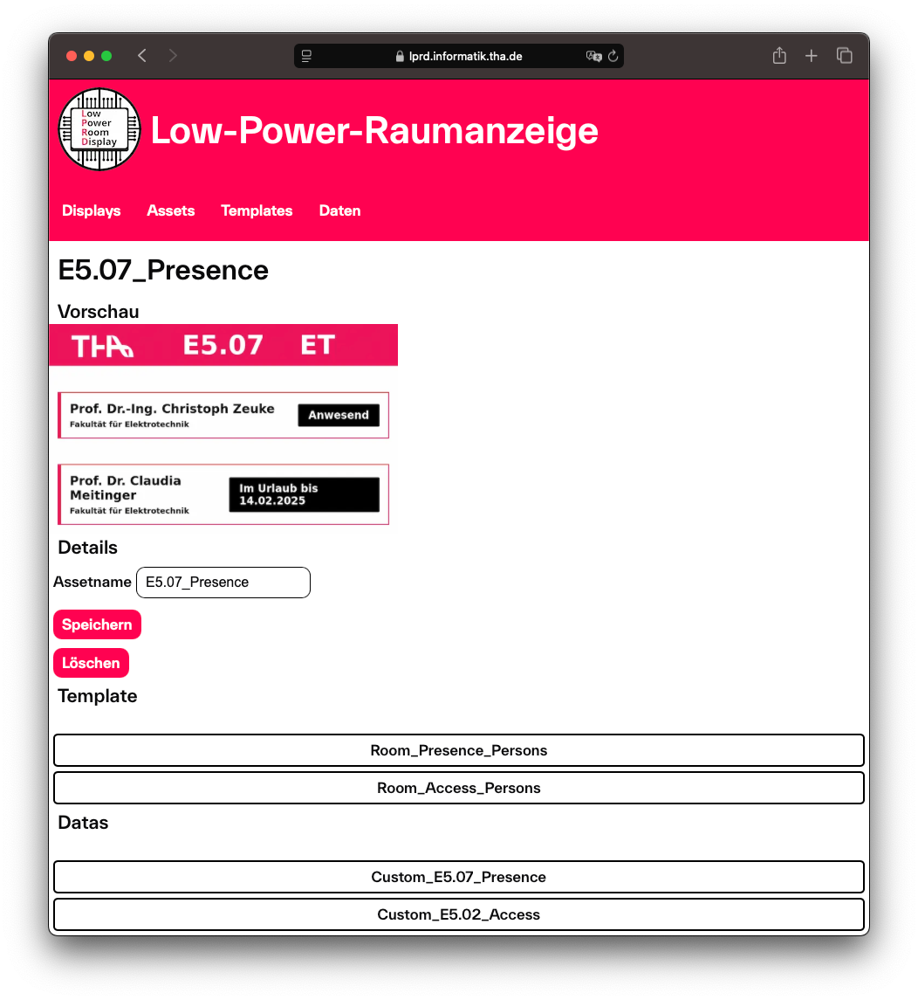
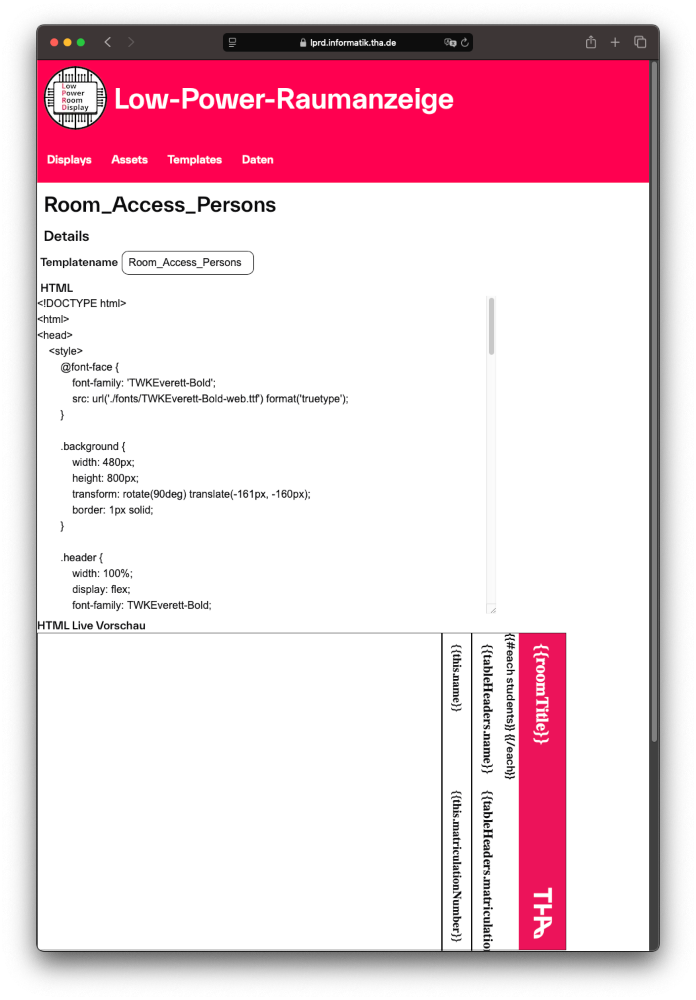
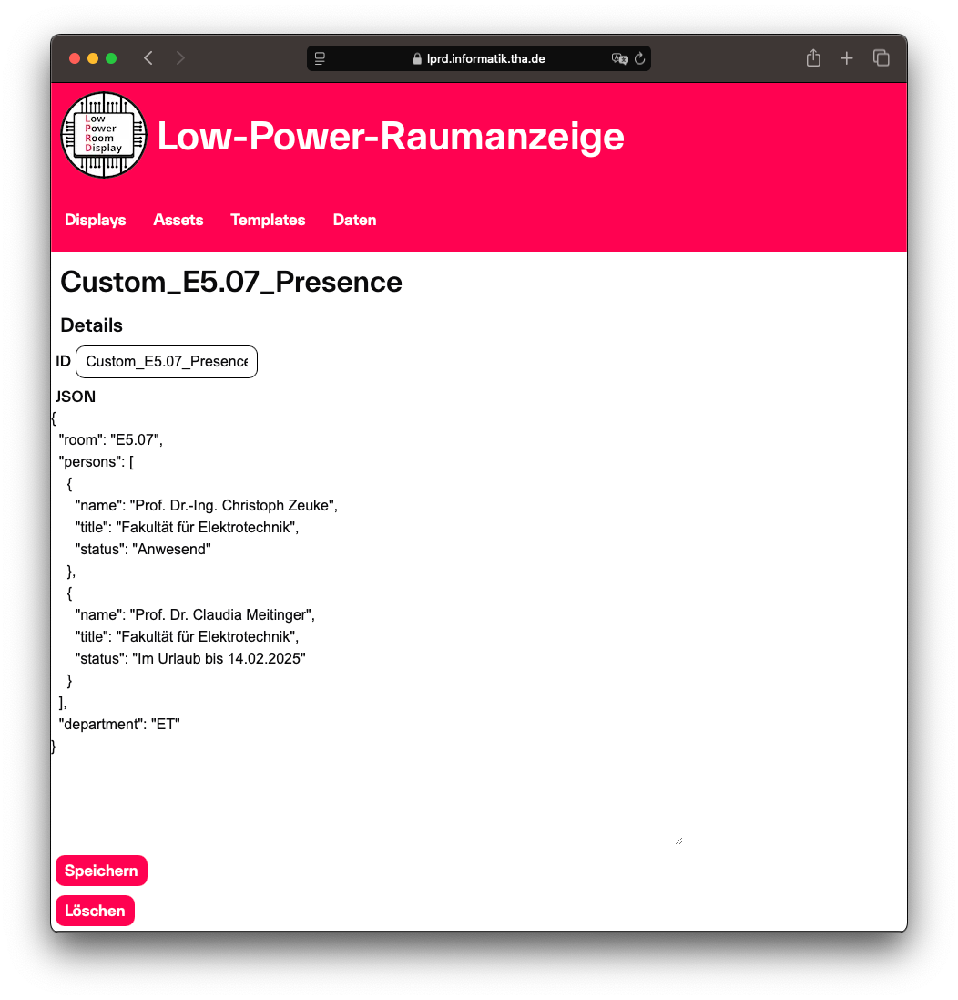

## Hinzufügen von Displaymodulen

Um ein neues Displaymodul hinzuzufügen, muss das Displaymodul gestartet werden und in der DeviceConfig der Servermodus aktiviert werden. Für den Servermodus wird ein bestehendes WLAN und die Server-URL benötigt. Nachdem der Servermodus aktiviert und das Displaymodul neu gestartet wurde, versucht dieses sich an dem Server anzumelden. Zuerst wird geprüft, ob das Displaymodul bei dem Server bereits bekannt ist, falls dies nicht der Fall ist, registriert sich das Displaymodul neu. In @APP-AlleDisplays ist die Übersicht aller bekannten Displaymodule gezeigt. 

## Zuweisen von Assets zu Displays

Ein Displaymodul kann wie in @APP-DetailDisplays gezeigt ausgewählt werden und neben einem Namen kann auch das anzuzeigende Bild, im weiteren Asset genannt, zugewiesen werden.  

## Erstellen von Assets

In der Webapplikation sind Assets, wie Hüllen für fertige Bilder, zu verstehen. Ein Asset kann genau ein Template haben, welches das Layout des Assets bestimmt und mehrere Daten zugewiesen bekommt, die das Template-Layout mit Inhalt befüllen. In @APP-AlleAssets ist die Übersicht aller erstellten Assets erkennbar, wird ein Asset ausgewählt, dann öffnet sich die Detailansicht wie in @APP-DetailAsset, in der ein Template und Daten ausgewählt werden können. 

## Erstellen von Templates

Ein Template kann wie in @APP-DetailTemplate auch aus der Übersicht für alle Templates ausgewählt werden. In dieser Detailansicht kann der Name des Templates und das HTML verändert werden, dabei wird bei jeder Änderung am HTML eine live Vorschau generiert, damit das Ergebnis gleichzeitig geprüft werden kann. 

## Erstellen von Daten

Analog zu Templates verhalten sich auch die Daten, wie in @APP-DetailData erkennbar. Anstatt HTML werden hierbei die Daten jedoch als JSON abgespeichert. Wird ein Datum abgespeichert, werden in der Datenbank alle damit verbundenen Assets automatisch neu generiert. 

