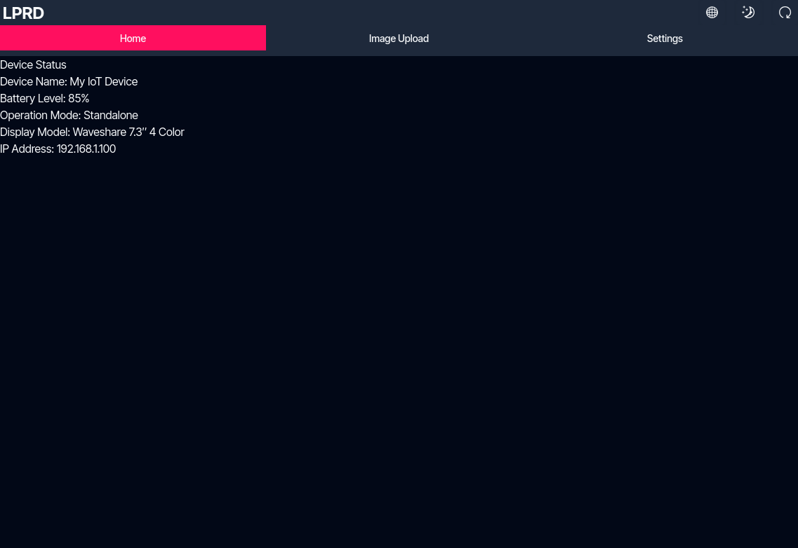
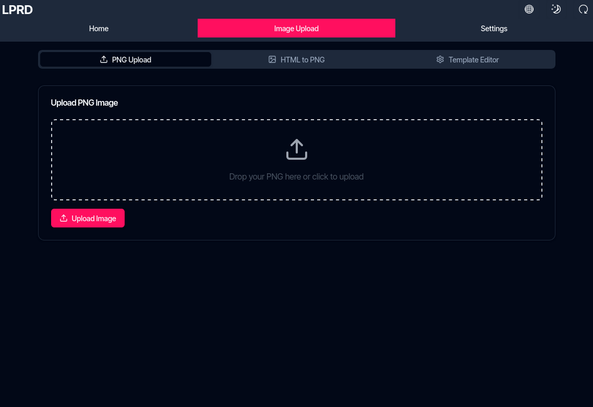
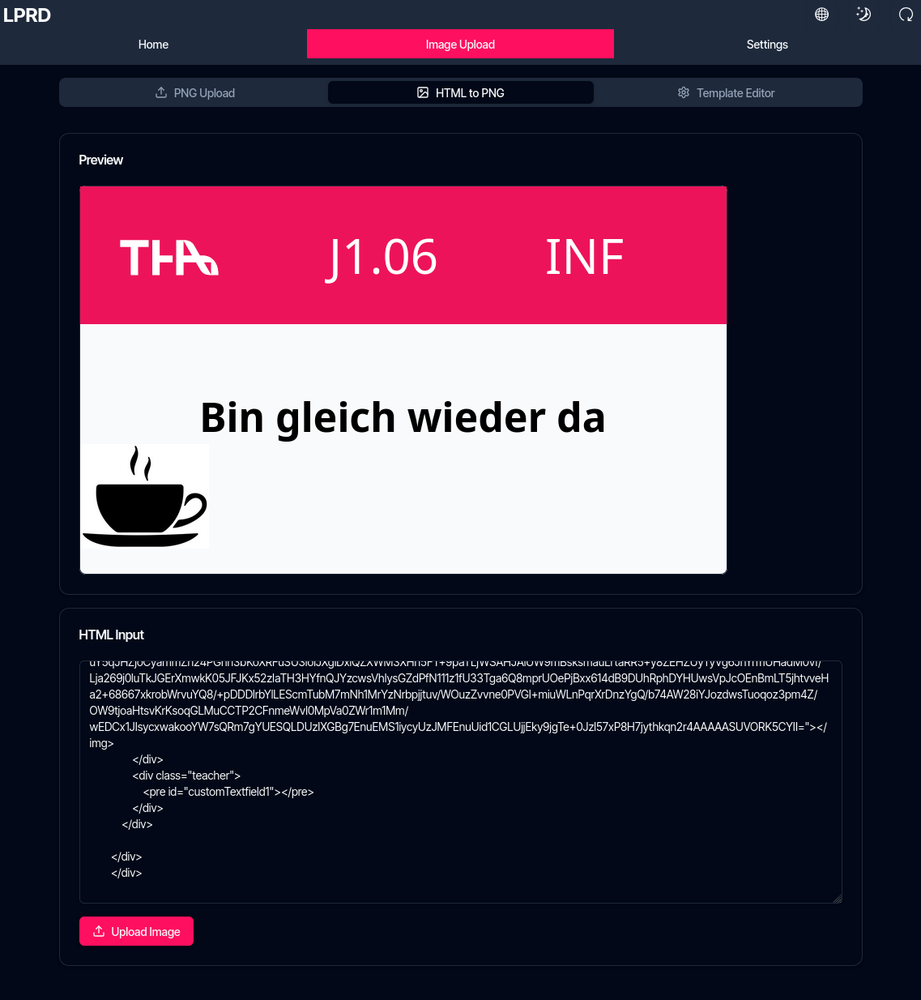
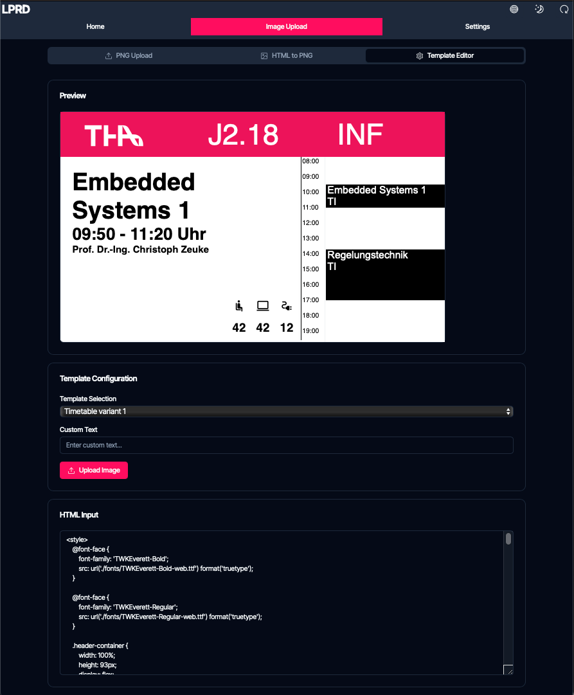

import { Steps } from '@astrojs/starlight/components';

Das ePaper-Anzeigemodul verfügt über eine moderne Weboberfläche, die mit Next.js erstellt wurde. Diese Oberfläche ermöglicht es Ihnen, Ihr Gerät zu steuern, Bilder hochzuladen und Einstellungen sowohl im Standalone- als auch im Netzwerk-Betriebsmodus zu konfigurieren.

## Zugriff auf die Oberfläche

Greifen Sie über einen Webbrowser auf die Weboberfläche zu:

- **Standalone-Modus**: Verbinden Sie sich mit dem WLAN-Netzwerk des Geräts und navigieren Sie dann zu `192.168.4.1`
- **Netzwerk-Modus**: Verbinden Sie sich mit demselben WLAN-Netzwerk wie das Gerät und navigieren Sie dann zur IP-Adresse des Geräts

Melden Sie sich mit Ihren Zugangsdaten an (Standard: Benutzername `admin`, Passwort `admin`)

## Startseite

Die Startseite ist so konzipiert, dass sie einen Überblick über den Status Ihres Geräts bietet. Gegenwärtig zeigt diese Seite nur Platzhalterdaten an, da ihre Funktionalität noch nicht vollständig implementiert wurde. Das Entwicklungsteam hat sich eher auf Kernfunktionen als auf dieses visuelle Element konzentriert.

Bei vollständiger Implementierung würde diese Seite Folgendes anzeigen:

- Gerätename
- Batteriestatus
- Betriebsmodus
- Display-Informationen
- IP-Adresse

## Bild-Upload

Der Bereich zum Hochladen von Bildern bietet drei Möglichkeiten, Inhalte auf Ihrem ePaper-Bildschirm anzuzeigen:

### PNG-Upload

Laden Sie vorher erstellte PNG-Bilder direkt hoch:

<Steps>
    1. Klicken Sie auf den Upload-Bereich oder ziehen Sie eine PNG-Datei per Drag & Drop hinein
    2. Das Bild sollte die gleiche Größe wie die native Displayauflösung haben. Größere Bilder werden ohne Skalierung abgeschnitten
    3. Klicken Sie auf "Hochladen", um das Bild an das Display zu senden
</Steps>

### HTML-zu-PNG-Konvertierung

Erstellen Sie benutzerdefinierte Anzeigen mit HTML:

<Steps>
    1. Geben Sie Ihren HTML-Code in den Editor ein
    2. Sehen Sie sich eine Live-Vorschau an, wie es aussehen wird
    3. Klicken Sie auf "Hochladen", um es zu konvertieren und auf dem ePaper-Bildschirm anzuzeigen
</Steps>

### Vorlagen-Editor

Erstellen Sie Anzeigen mit vordesignten Vorlagen:

<Steps>
    1. Wählen Sie eine Vorlage aus dem Dropdown-Menü
    2. Passen Sie die Inhaltsfelder an
    3. Sehen Sie sich die Live-Vorschau an
    4. Klicken Sie auf "Hochladen", um es auf dem Gerät anzuzeigen
</Steps>

## Einstellungen

Im Bereich Einstellungen können Sie alle Aspekte Ihres Geräts konfigurieren:

- **Gerätekonfiguration**: Betriebsmodus und Netzwerkeinstellungen festlegen
- **HTTP-Server-Einstellungen**: Konfigurieren Sie Webzugriffseinstellungen
- **Display-Konfiguration**: Displaytyp auswählen
- **Erweiterte Einstellungen**: Zugriff auf Protokollierungs- und Systemoptionen

Detaillierte Informationen zu allen verfügbaren Einstellungen finden Sie in der [Einstellungsdokumentation](../../settings).

## Gerät neu starten

Die Weboberfläche enthält eine Neustart-Schaltfläche in der oberen rechten Ecke, mit der Sie das Gerät bei Bedarf neu starten können, insbesondere nach dem Ändern von Einstellungen.