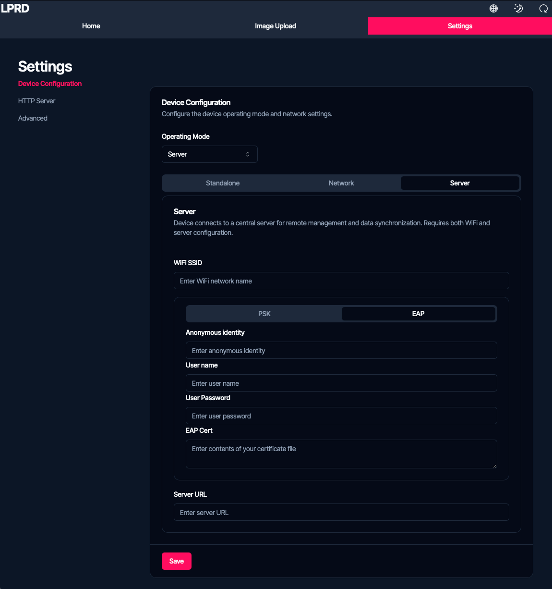
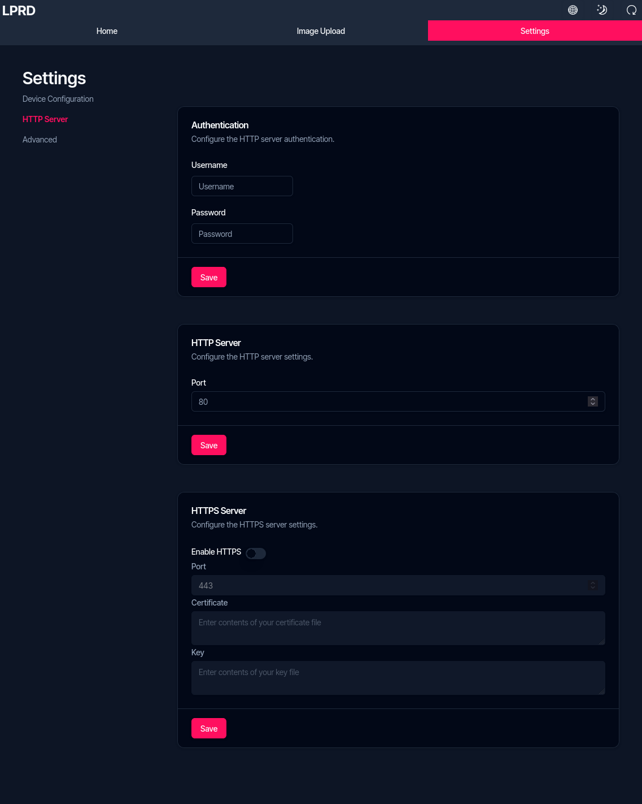
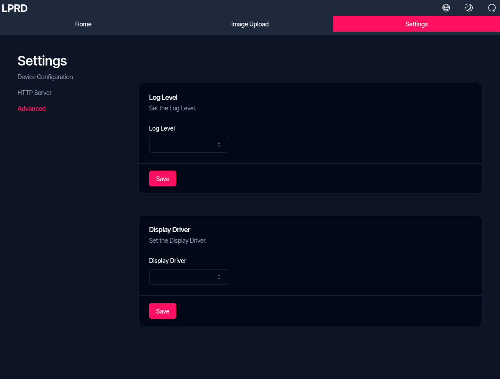

import { Aside } from '@astrojs/starlight/components';
import { Steps } from '@astrojs/starlight/components';

Das ePaper-Anzeigemodul bietet verschiedene Konfigurationsmöglichkeiten über seine Weboberfläche. Diese Seite beschreibt alle verfügbaren Einstellungen und deren Verwendung.

## Zugriff auf Einstellungen

<Steps>
    1. Verbinden Sie sich mit Ihrem Gerät:

        

            - Im Standalone-Modus: Verbinden Sie sich mit dem WLAN des Geräts und rufen Sie `192.168.4.1` auf
            - Im Netzwerk-Modus: Verbinden Sie sich mit demselben WLAN wie das Gerät und verwenden Sie die IP-Adresse des Geräts
        

    2. Melden Sie sich mit Ihren Zugangsdaten an (Standard: Benutzername `admin`, Passwort `admin`)
    3. Navigieren Sie zum Bereich Einstellungen in der Weboberfläche
</Steps>

## Gerätekonfiguration

### Betriebsmodus

Wählen Sie den Betriebsmodus, der am besten zu Ihren Anforderungen passt:

- **Standalone-Modus**: Das Gerät erstellt sein eigenes WLAN-Netzwerk

    - SSID konfigurieren: Der Name des vom Gerät erstellten WLAN-Netzwerks
    - Passwort konfigurieren: Legen Sie ein Passwort für das WLAN-Netzwerk fest (mindestens 8 Zeichen)

- **Netzwerk-Modus**: Das Gerät verbindet sich mit Ihrem bestehenden WLAN-Netzwerk

    - SSID eingeben: Ihr WLAN-Netzwerkname
    - Passwort eingeben: Ihr WLAN-Netzwerkpasswort

- **Server-Modus**: Das Gerät verbindet sich mit einem zentralen Server für die Fernverwaltung

    - Geben Sie SSID und Passwort für Ihr WLAN-Netzwerk ein
    - Server-URL eingeben: Die Adresse des zentralen Verwaltungsservers

### WLAN-Konfiguration

#### WPA2-PSK (Standard)

Für typische Heim- und Büronetzwerke:

- SSID: Name des WLAN-Netzwerks
- Passwort: Netzwerkpasswort

#### WPA2-Enterprise

Für Netzwerke wie eduroam an Bildungseinrichtungen:

- SSID: Netzwerkname
- Identität: Ihre EAP-Identität
- Benutzername: Ihr EAP-Benutzername
- Zertifikat: Laden Sie das erforderliche Zertifikat hoch

## HTTP-Server-Einstellungen

### Authentifizierung

Kontrolle des Zugriffs auf die Weboberfläche:

- Benutzername: Legen Sie den Admin-Benutzernamen fest
- Passwort: Legen Sie das Admin-Passwort fest

### Verbindungseinstellungen

- HTTP-Port: Konfigurieren Sie den Port für HTTP-Verbindungen (Standard: 80)
- HTTPS aktivieren: Sichere Verbindungen ein-/ausschalten
- HTTPS-Port: Konfigurieren Sie den Port für HTTPS-Verbindungen (Standard: 443)

### SSL-Zertifikate

Wenn HTTPS aktiviert ist, laden Sie Ihre Zertifikate hoch:

- SSL-Zertifikat: Laden Sie Ihre Zertifikatsdatei hoch
- SSL-Schlüssel: Laden Sie Ihre private Schlüsseldatei hoch

## Erweiterte Einstellungen

### Display-Konfiguration

Wählen Sie den passenden Treiber für Ihr ePaper-Display:

- WaveShare 7.3" ePaper
- GoodDisplay 7.5" ePaper
- WaveShare 9.7" ePaper

### Protokollierungsebene

Legen Sie die Detailebene für Systemprotokolle fest:

- Fehler: Nur kritische Fehler
- Warnung: Fehler und Warnungen
- Info: Allgemeine Betriebsinformationen
- Debug: Detaillierte Informationen zur Fehlerbehebung
- Trace: Detaillierteste Diagnoseinformationen

### Werkseinstellungen

Die Werkseinstellungen können nur mit den Hardware-Tasten durchgeführt werden:

<Steps>
    1. Führen Sie einen Stromzyklus des Geräts durch (Batterie trennen und wieder anschließen)
    2. Halten Sie während des Startvorgangs Taste 1 für 5 Sekunden gedrückt
</Steps>

<Aside type="tip">
    Alternativ kann die Reset-Taste auf der Rückseite verwendet werden, während Taste 1 gedrückt wird.
</Aside>

## Änderungen speichern

Nachdem Sie Einstellungen angepasst haben:

<Steps>
    1. Klicken Sie auf die Schaltfläche "Speichern" am unteren Rand der Seite
    2. Um Änderungen anzuwenden, verwenden Sie die Neustart-Taste in der oberen rechten Ecke der Weboberfläche
</Steps>

Sie können das Gerät auch neu starten durch:

- Drücken der Reset-Taste auf der Rückseite des Geräts
- Trennen und Wiederanschließen der Batterie

<Aside type="tip">
    Wenn Sie Netzwerkeinstellungen ändern, notieren Sie sich die neuen Verbindungsdaten vor dem Neustart, da Sie sich möglicherweise danach anders verbinden müssen.
</Aside>