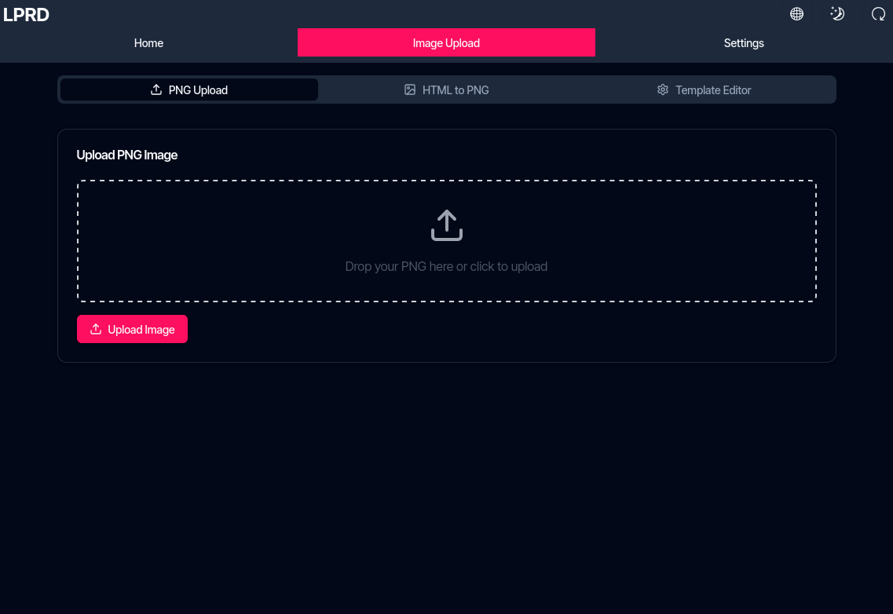

import { Steps } from '@astrojs/starlight/components';

The ePaper display module features a modern web interface built with Next.js. This interface allows you to control your device, upload images, and configure settings in both Standalone and Network operating modes.

## Accessing the Interface

Access the web interface through a web browser:

- **Standalone mode**: Connect to the device's WiFi network, then navigate to `192.168.4.1`
- **Network mode**: Connect to the same WiFi network as the device, then navigate to the device's IP address

Log in with your credentials (default: username `admin`, password `admin`)

## Home Page

The home page is designed to provide an overview of your device's status. Currently, this page displays only placeholder data as its functionality has not been fully implemented yet. The development team focused on core features rather than this visual element.

When fully implemented, this page would show:

- Device name
- Battery status
- Operating mode
- Display information
- IP address

## Image Upload

The Image Upload section provides three ways to display content on your ePaper screen:

### PNG Upload

Upload pre-created PNG images directly:

<Steps>
    1. Click the upload area or drag and drop a PNG file
    2. The image should same size as the native display resolution. Larger images will be cut off without scaling
    3. Click "Upload" to send the image to the display
</Steps>

### HTML to PNG Conversion

Create custom displays using HTML:

<Steps>
    1. Enter your HTML code in the editor
    2. View a live preview of how it will appear
    3. Click "Upload" to convert and display on the ePaper screen
</Steps>

### Template Editor

Create displays using pre-designed templates:

<Steps>
    1. Select a template from the dropdown menu
    2. Customize the content fields
    3. View the live preview
    4. Click "Upload" to display on the device
</Steps>

## Settings

The Settings section allows you to configure all aspects of your device:

- **Device Configuration**: Set operating mode and network settings
- **HTTP Server Settings**: Configure web access settings
- **Display Configuration**: Select display type
- **Advanced Settings**: Access logging and system options

For detailed information about all available settings, see the [Settings documentation](../../settings).

## Restart Device

The web interface includes a restart button in the top right corner that allows you to reboot the device when needed, particularly after changing settings.