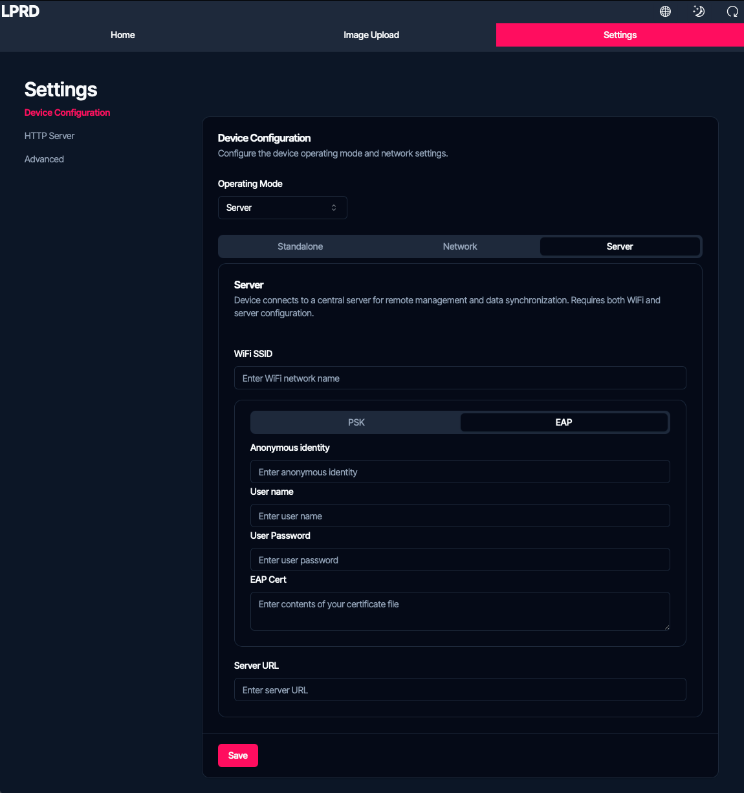
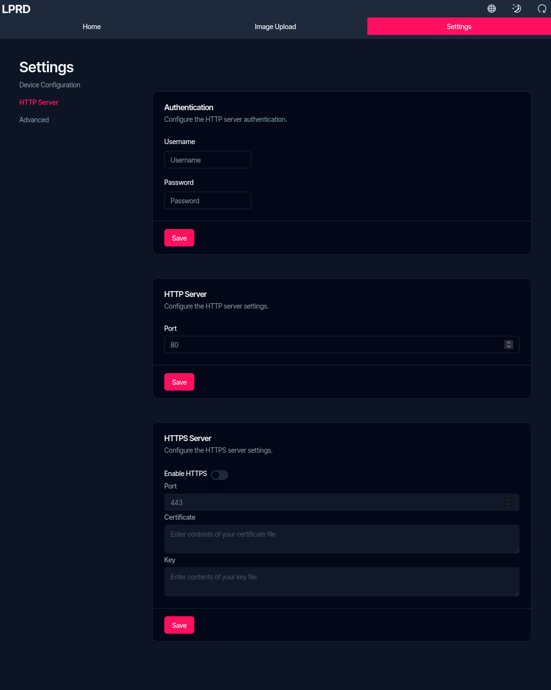
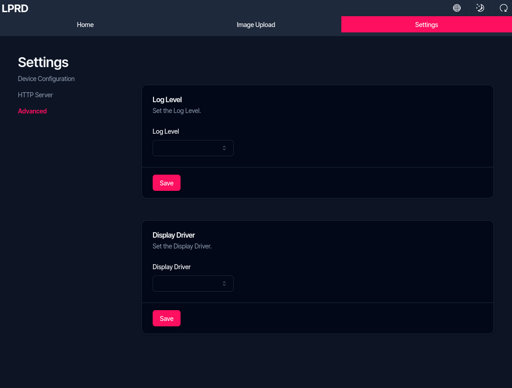

import { Aside } from '@astrojs/starlight/components';
import { Steps } from '@astrojs/starlight/components';

The ePaper display module offers various configuration options through its web interface. This page describes all available settings and how to use them.

## Accessing Settings

<Steps>
    1. Connect to your device:

        

            - In Standalone mode: Connect to the device's WiFi and access `192.168.4.1`
            - In Network mode: Connect to the same WiFi as the device and use the device's IP address
        

    2. Log in with your credentials (default: username `admin`, password `admin`)
    3. Navigate to the Settings section in the web interface
</Steps>

## Device Configuration

### Operating Mode

Select the operating mode that best suits your needs:

- **Standalone Mode**: The device creates its own WiFi network

    - Configure SSID: The name of the WiFi network created by the device
    - Configure Password: Set a password for the WiFi network (minimum 8 characters)

- **Network Mode**: The device connects to your existing WiFi network

    - Enter SSID: Your WiFi network name
    - Enter Password: Your WiFi network password

- **Server Mode**: The device connects to a central server for remote management

    - Enter SSID and Password for your WiFi network
    - Enter Server URL: The address of the central management server

### WiFi Configuration

#### WPA2-PSK (Standard)

For typical home and office networks:

- SSID: Name of the WiFi network
- Password: Network password

#### WPA2-Enterprise

For networks like eduroam at educational institutions:

- SSID: Network name
- Identity: Your EAP identity
- Username: Your EAP username
- Certificate: Upload the required certificate

## HTTP Server Settings

### Authentication

Control access to the web interface:

- Username: Set the admin username
- Password: Set the admin password

### Connection Settings

- HTTP Port: Configure the port for HTTP connections (default: 80)
- Enable HTTPS: Toggle secure connections on/off
- HTTPS Port: Configure the port for HTTPS connections (default: 443)

### SSL Certificates

If HTTPS is enabled, upload your certificates:

- SSL Certificate: Upload your certificate file
- SSL Key: Upload your private key file

## Advanced Settings

### Display Configuration

Select the appropriate driver for your ePaper display:

- WaveShare 7.3" ePaper
- GoodDisplay 7.5" ePaper
- WaveShare 9.7" ePaper

### Logging Level

Set the detail level for system logs:

- Error: Only critical errors
- Warning: Errors and warnings
- Info: General operational information
- Debug: Detailed information for troubleshooting
- Trace: Most detailed diagnostic information

### Factory Reset

Factory reset can only be performed using hardware buttons:

<Steps>
    1. Power cycle the device (disconnect and reconnect the battery)
    2. During startup, press and hold button 1 for 5 seconds
</Steps>

<Aside type="tip">
    Alternatively, the reset button on the back can be used while holding button 1.
</Aside>

## Saving Changes

After adjusting any settings:

<Steps>
    1. Click the "Save" button at the bottom of the page
    2. To apply changes, use the restart button in the top right corner of the web interface
</Steps>

You can also restart the device by:

- Pressing the reset button on the back of the device
- Disconnecting and reconnecting the battery

<Aside type="tip">
    If you change network settings, note the new connection details before restarting, as you may need to connect differently afterward.
</Aside>
